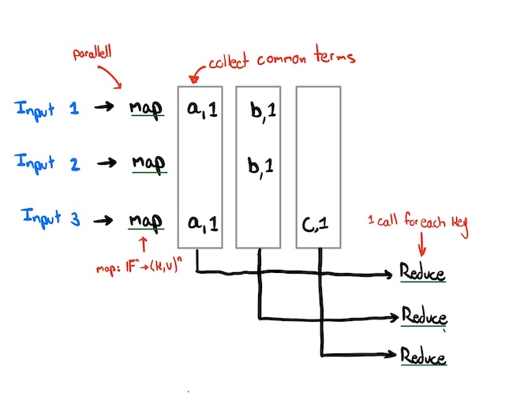

# Lecture 1: Introduction
Video: [Lecture 1: Introduction](https://youtu.be/cQP8WApzIQQ?si=Q8PZxjqJGhzs4OO3)
Paper: [MapReduce](/mapreduce-paper.pdf)

**Note:** If you can solve a problem without the need of more than one computer, that is *probably* the better solution.

 **Motivations:** 
 * Critical infrastructure is built out of distributed systems
 * *parellism* - multiple tasks at the same time
 * *fault tolerance* - if one computer fails there is redundency
 * *physical constraints* - geographic constrinats
 * *security/isolation* - only want to interact with other computers when necessary

**Challenges:**
* *concurrency* - how do you "share" resources...
* *partial failure* - if one computer fails the whole system may not fail
* *performance* - may be difficult to get the performance 

**Infrastructure**
* *Storage* - 
* *Communication* - Tool to build distributed systems
* *Computation* - 

**Goal:** Build **abstraction** that hides the distrubited nature of the systems

**Implementation:**
* remoce procedure call (RPC) - Mask the fact that you are communicating over network
* threads - a way of structuring concurrent operations
* concurrency control (e.g., locks)

**Performance:**
* *Scalability* - Ratio *computers:throughput*

**Fault Tolerance:**
* *Availability* - Continue operating even under certain set of failure
* *Recoverability* - If something went wrong, once repaired can be restored without loss of correctness (weaker requirement)

Tools available are,
1. *Non-volatile storages* (i.e., SSD, Hardrives, Flash)
2. *Replication* - Management of replicated copies

Scale turn rare problems into every day reoccuring events. 

**Want:** Hide the failures from application programmers

**Consistency:**
* What are the rules the sytem needs to maintain consistency
* What are the guarantees *(Strong, Weak)*

Issue: often more than one copy of the data (because of replication/caching). 

Note: strong consistency requires a lot of resources.

### MapReduce (Case Study)

*Fig 1.1 Simple Example of mapReduce Framework of a job with 3 inputs*

* Job: the whole process
* Task: each instance of map or reduce

Where doe the input and output live?
* Input: Lives on a file system (map & reduce are run locally on the files)
* Output: Lives on a filesystem

**Goal:** To minimize communication between servers and maximizing parrellism

